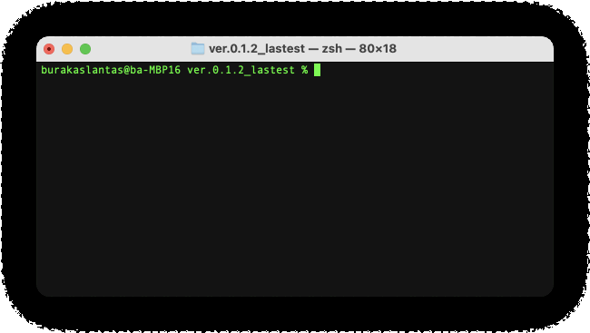

<h1 align="center">Pointer Editor</h2>

Command-based text editor.

## Features

* ***Thoughtful UI,*** get feedback about last performed command.
* ***Compact design,*** display 10 lines on each page.
* ***Never lose,*** save edited file to the local disk.
* ***Edit faster,*** using "insert", "delete", "replace" and "move" commands.
* ***No mistake,*** using "undo" command, revert back to last taken action.
