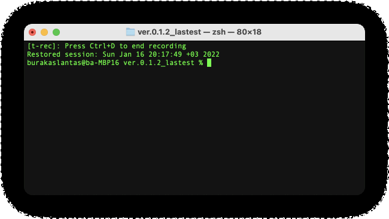

<h1 align="center">Pointer Editor</h2>

Command-based text editor.

## Features

* ***Thoughtful UI,*** get feedback about last performed command.
* ***Compact design,*** display 10 lines on each page.
* ***Never lose,*** save edited file to the local disk.
* ***Edit faster,*** using "insert", "delete", "replace" and "move" commands.
* ***No mistake,*** using "undo" command, revert back to last taken action.

## Install

* Download from the [releases page](https://github.com/burakaslantas/PointerEditor/releases/)
* Extract files from zip
* use `g++ textEditor.h IntSLList.cpp IntSLList.h main.cpp` to compile files.
* Using `./a.out` command, run the program.

## Usage
|Option Name|Example Usage|Description|
|----------------|------------------|-------------------------------|
|`open filename` |`open abc.txt`    |Open the file whose name is provided in the field `filename` and loads its contents.      |
|`save filename` |`save abc.txt`    |Write the contents of the text to the file whose name is provided in the `filename` field.|
|`insert n text` |`insert 3 hello!` |Insert a new line at position `n` with the string provided in `text`.                     |
|`delete n`      |`delete 3`        |Delete the line at position `n`.                                                          |
|`move n m`      |`move 3 5`        |Move the line at position `n` to position `m`.                                            |
|`replace n text`|`replace 3 hello!`|Replace the text inside line `n` with the string provided in `text`.                      |
|`next`          |`next`            |Display the next page.                                                                    |
|`prev`          |`prev`            |Display the previous page.                                                                |
|`undo`          |`undo`            |Reverts the last taken action.                                                            |
|`exit`          |`exit`            |Exit from program.                                                                        |
